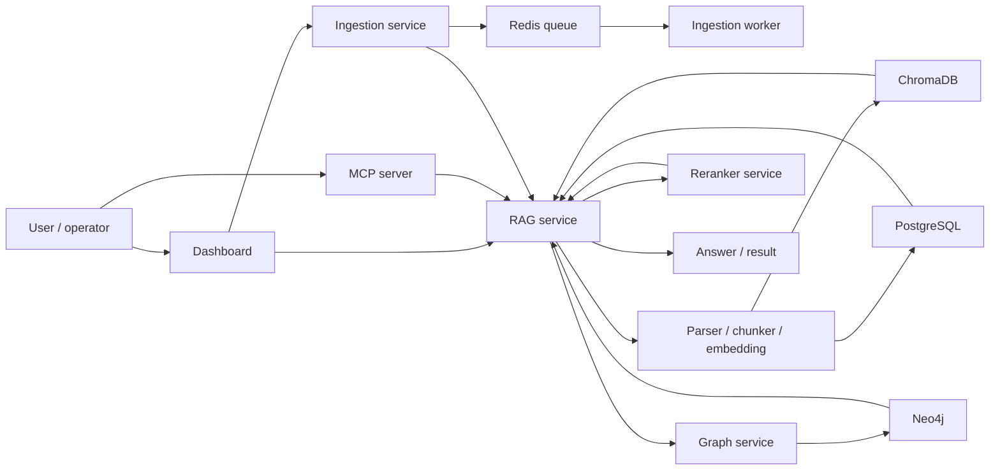

# Documentation

This folder contains the project documentation in English, with Thai supplemental copies under `docs/th/`.

This repository is intended as a learning resource for understanding how a RAG system is organized, wired, and operated.

Return to the main project page: [README](../README.md)

## What to read first

| Stage | Read this | Why |
|---|---|---|
| 1 | [Environment](environment.md) | See the minimum variables needed to boot the stack |
| 2 | [Requirement](requirement.md) | Understand what the system is expected to do |
| 3 | [Design](design.md) | Understand how the system is structured |
| 4 | [Task](task.md) | See the concrete implementation work in the repo |

## System Flow

```text
User / operator
  -> Dashboard or MCP server
  -> Service entrypoint
  -> API router and dependency wiring
  -> Application use case
  -> Infrastructure adapter
  -> Database / vector store / graph store / queue
  -> Response back to the caller
```



Reading the flow from top to bottom helps connect the docs to the codebase:

1. `Environment` shows what the system needs to start
2. `Requirement` shows what the system is supposed to do
3. `Design` shows how the services and layers are split
4. `Task` shows where the behavior lives in code

## Walkthroughs

Use these pages when you want to follow a request step by step through the actual code path:

- [Ingestion walkthrough](ingestion-walkthrough.md)
- [Query walkthrough](query-walkthrough.md)

## 10-Minute Reading Plan

If you want a fast walkthrough, spend about 10 minutes in this order:

1. `README.md` in the project root to get the big picture
2. `docs/README.md` to understand the learning path
3. `docs/environment.md` to see how the stack boots
4. `docs/requirement.md` to learn the system goals
5. `docs/design.md` to understand the architecture
6. `docs/task.md` to connect the docs back to source code
7. `ingestion/ingestion-service/interface/routers.py` to see the ingestion API flow
8. `core/rag-service/interface/routers.py` to see the query flow
9. `core/graph-service/interface/routers.py` and `intelligence/intelligence-service/main.py` for the graph and background-job parts
10. `platform/dashboard/src/app/*` and `platform/mcp-server/src/*` to see how humans and tools interact with the system

## English docs

- [Environment](environment.md)
- [Requirement](requirement.md)
- [Design](design.md)
- [Task](task.md)
- [Ingestion walkthrough](ingestion-walkthrough.md)
- [Query walkthrough](query-walkthrough.md)

## Thai supplemental docs

- [Thai docs index](th/README.md)
- [Environment - Thai](th/environment.md)
- [Requirement - Thai](th/requirement.md)
- [Design - Thai](th/design.md)
- [Task - Thai](th/task.md)
- [Ingestion walkthrough - Thai](th/ingestion-walkthrough.md)
- [Query walkthrough - Thai](th/query-walkthrough.md)

## Notes

- The English documents are the primary reference for the repository.
- The Thai files are supplementary copies for convenience.
- Start with `Environment`, then move to `Requirement`, `Design`, and `Task`.
