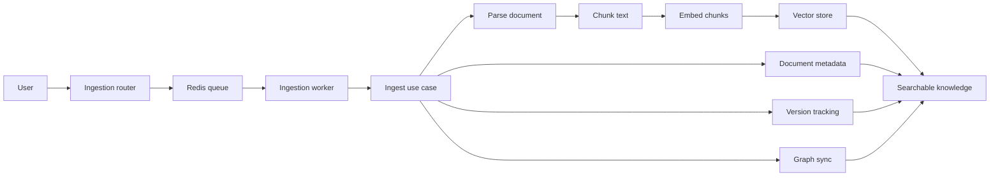

# Ingestion Walkthrough

This page follows one document from the moment it is submitted until it becomes searchable in the RAG stack.

## Why this matters

Ingestion is the path that turns raw files, text, or URLs into indexed knowledge. If you understand this flow, you can trace where chunking, embeddings, graph extraction, and document versioning happen.

## End-to-end flow

```text
User uploads a document
  -> Ingestion API validates the request
  -> A job is queued in Redis
  -> The background worker picks up the job
  -> The use case parses, chunks, embeds, and stores the content
  -> Metadata and versions are persisted
  -> The document becomes available for retrieval
```



## Step by step

### 1. The request enters the ingestion service

The normal entry point is the ingestion router in `ingestion/ingestion-service/interface/routers.py`.

Typical entry paths include:

- file upload
- raw text ingestion
- ingestion preview
- retry, cancel, or reprocess actions

The router is responsible for validating input and converting it into the request objects expected by the application layer.

### 2. The job is scheduled

For asynchronous ingestion, the router puts a job into the Redis-backed queue.

This keeps the API responsive while the heavier work runs in the background. The queue also gives the service a place to track job status, retries, and cancellation.

### 3. The worker pulls the job

`ingestion/ingestion-service/application/ingestion_worker.py` continuously consumes jobs from the queue.

The worker:

- skips cancelled jobs
- marks a job as processing
- updates progress
- retries on transient failures
- marks the job as done or failed

This is the layer that turns a queued task into a real ingestion execution.

### 4. The use case processes the content

The core ingestion logic lives in `ingestion/ingestion-service/application/ingest_document_use_case.py`.

The flow is roughly:

1. Compute a content hash
2. Parse the document into text
3. Check whether the same document already exists
4. Store document metadata
5. Split the text into chunks
6. Generate embeddings for the chunks
7. Upsert the chunks into the vector store
8. Persist the document and version records
9. Clean up older versions if needed

This is the point where raw content becomes searchable knowledge.

### 5. Graph-related work is included

The service also keeps the graph side of the system in mind.

When the ingestion flow reaches the graph stage, the worker reports progress accordingly and the graph-related pipeline can sync entities and relationships into the graph service / Neo4j side of the stack.

### 6. Preview is a lighter version of the same path

The preview endpoint uses the same general understanding of the document, but it stops before the full persistence path.

This lets you inspect what would happen before you commit the job to the full ingestion pipeline.

### 7. Status updates keep the UI informed

While the worker runs, the job status moves through states such as queued, processing, done, failed, or cancelled.

That status path is what powers the dashboard views and lets users know whether ingestion is still running or already finished.

## What to read in the code next

- `ingestion/ingestion-service/interface/routers.py`
- `ingestion/ingestion-service/application/ingestion_worker.py`
- `ingestion/ingestion-service/application/ingest_document_use_case.py`
- `ingestion/ingestion-service/application/preview_ingestion_use_case.py`
- `ingestion/ingestion-service/infrastructure/` adapters for storage and parsing

## Learning takeaway

If a document is not searchable, the bug is usually in one of these stages:

- request validation
- queueing
- parsing
- chunking
- embedding
- vector upsert
- metadata persistence
- version bookkeeping
