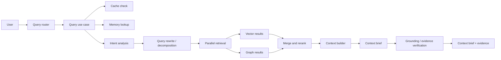

# Query Walkthrough

This page follows a user question from the moment it is submitted until the system returns a structured context brief with supporting evidence.

## Why this matters

Query handling is where the RAG design becomes visible. You can see retrieval, reranking, memory use, grounding, and context shaping all in one pipeline.

## End-to-end flow

```text
User asks a question
  -> Query API receives the request
  -> The use case checks cache, memory, and query intent
  -> Retrieval runs against vector and graph sources
  -> Results are merged and reranked
  -> Context is built and compressed
  -> The context brief is assembled and verified
  -> Supporting evidence and metadata are returned
```



## Step by step

### 1. The request enters the RAG service

The main entry point is `core/rag-service/interface/routers.py`.

That router accepts the query payload and hands control to the application layer. It is the boundary between HTTP and the RAG pipeline.

### 2. The use case starts orchestration

The main orchestration lives in `core/rag-service/application/query_use_case.py`.

Before retrieval starts, the use case may:

- enforce rate limits
- read semantic cache entries
- consult memory
- analyze query intent
- rewrite or decompose the query

This stage decides how expensive the rest of the pipeline should be.

### 3. Retrieval runs in parallel

The query is expanded into retrieval work against multiple sources.

Common paths include:

- vector retrieval from the chunk store
- graph retrieval from the graph service
- namespace-aware or source-aware retrieval

The pipeline then merges these candidate sets, often using ranking fusion techniques such as RRF.

### 4. Candidates are ranked again

After the first retrieval pass, the system reranks the candidates.

This step helps the final context focus on the passages that are most useful for the user question, not just the most similar by embedding score.

### 5. Context is built

The use case then prepares the final context for downstream context brief assembly.

It may:

- group related passages
- compress long context
- prefer fresher information when needed
- add memory or conversation context
- route part of the request to tools if a tool call is appropriate

This is the stage where retrieval output becomes prompt-ready evidence.

### 6. The context brief is assembled from context

Once the context is ready, the service returns the context-derived brief directly.

The pipeline can work in streaming or non-streaming mode, depending on the caller. Streaming is useful when the UI should show partial output quickly.

### 7. Evidence checks happen at the end

The service does not stop at context assembly.

It checks whether the returned brief is grounded in the retrieved evidence and returns supporting references with the final response.

### 8. Feedback can be recorded

When the pipeline detects gaps or uncertainty, it can record signals for later analysis.

That data helps the intelligence layer learn where the system needs better retrieval, better coverage, or better prompts.

### 9. Streaming and non-streaming share the same core pipeline

The final context-answer step can return output in one shot or stream tokens incrementally.

Both modes use the same upstream retrieval and context-building stages, so debugging usually starts above the response delivery layer, not at the transport layer.

## What to read in the code next

- `core/rag-service/interface/routers.py`
- `core/rag-service/application/query_use_case.py`
- `core/rag-service/application/retrieval/`
- `core/rag-service/application/context_compressor.py`
- `core/rag-service/infrastructure/`
- `intelligence-service/main.py`

## Learning takeaway

If a question gets a weak answer, the problem usually sits in one of these places:

- query rewrite
- retrieval quality
- reranking
- context packing
- compression settings
- evidence verification
