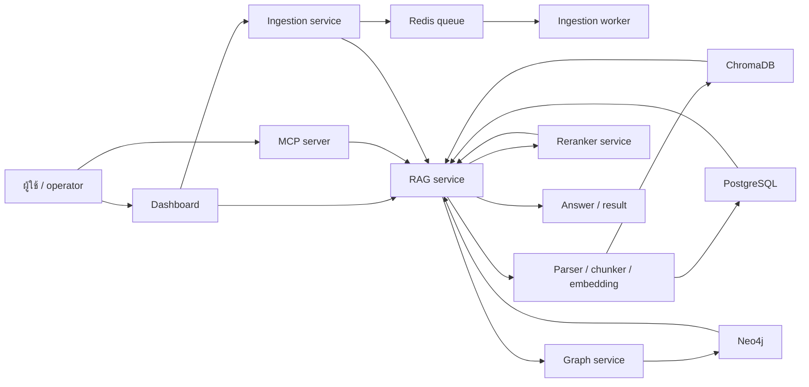

# เอกสารภาษาไทย

เอกสารในโฟลเดอร์นี้เป็นฉบับเสริมภาษาไทยของเอกสารหลักภาษาอังกฤษ

## ควรอ่านอะไรก่อน

| ลำดับ | อ่านไฟล์นี้ | เหตุผล |
|---|---|---|
| 1 | [Environment](environment.md) | ดูค่าที่ต้องใช้เพื่อบูตระบบขั้นต่ำ |
| 2 | [Requirement](requirement.md) | เข้าใจว่าระบบต้องทำอะไร |
| 3 | [Design](design.md) | เข้าใจโครงสร้างและสถาปัตยกรรม |
| 4 | [Task](task.md) | ดูงานที่ลงมือทำจริงใน repo |

## สารบัญ

- [Environment](environment.md)
- [Requirement](requirement.md)
- [Design](design.md)
- [Task](task.md)
- [Ingestion walkthrough](ingestion-walkthrough.md)
- [Query walkthrough](query-walkthrough.md)

## System Flow

```text
ผู้ใช้ / operator
  -> Dashboard หรือ MCP server
  -> Service entrypoint
  -> API router และ dependency wiring
  -> Application use case
  -> Infrastructure adapter
  -> ฐานข้อมูล / vector store / graph store / queue
  -> Response กลับไปยังผู้เรียก
```



## RAG Cheat Sheet

- `retrieval` คือการค้นหาชิ้นข้อมูลที่เกี่ยวข้องที่สุดกับคำถาม
- `chunking` คือการแบ่งเอกสารเป็นส่วนย่อยเพื่อให้ index และค้นหาได้
- `embedding` คือการแปลงข้อความเป็น vector สำหรับหา semantic similarity
- `reranking` คือการเรียงลำดับ candidate หลัง retrieval รอบแรก
- `grounding` คือการทำให้คำตอบยึดกับหลักฐานจาก source จริง
- `citation` คือการอ้างอิง passage หรือแหล่งข้อมูลที่ใช้ตอบ
- `memory` คือ context ที่เก็บไว้เพื่อใช้ซ้ำ
- `graph extraction` คือการดึง entity และความสัมพันธ์ออกมาเป็น graph

## Walkthroughs

ถ้าต้องการดู flow แบบทีละขั้น ให้เปิดเอกสารเหล่านี้:

- [Ingestion walkthrough](ingestion-walkthrough.md)
- [Query walkthrough](query-walkthrough.md)

## หมายเหตุ

- เอกสารภาษาอังกฤษใน `docs/` เป็นเอกสารหลัก
- เอกสารภาษาไทยจัดทำเพื่อช่วยอ่านและอ้างอิง
