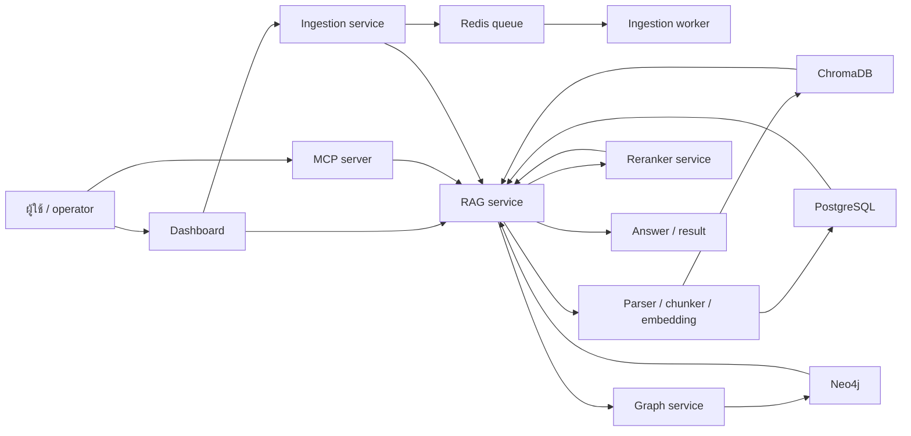
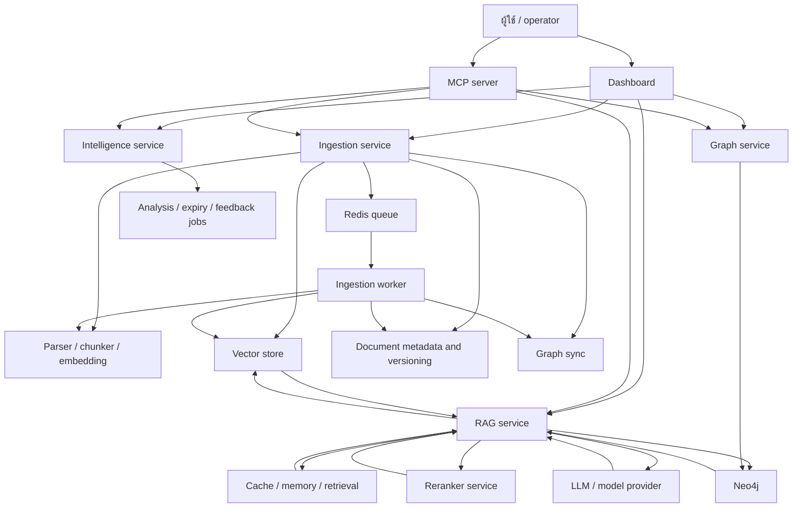

# เอกสารภาษาไทย

เอกสารในโฟลเดอร์นี้เป็นฉบับเสริมภาษาไทยของเอกสารหลักภาษาอังกฤษ

## ควรอ่านอะไรก่อน

| ลำดับ | อ่านไฟล์นี้ | เหตุผล |
|---|---|---|
| 1 | [Environment](environment.md) | ดูค่าที่ต้องใช้เพื่อบูตระบบขั้นต่ำ |
| 2 | [Requirement](requirement.md) | เข้าใจว่าระบบต้องทำอะไร |
| 3 | [Design](design.md) | เข้าใจโครงสร้างและสถาปัตยกรรม |
| 4 | [Task](task.md) | ดูงานที่ลงมือทำจริงใน repo |

## สารบัญ

- [Environment](environment.md)
- [Requirement](requirement.md)
- [Design](design.md)
- [Task](task.md)
- [Ingestion walkthrough](ingestion-walkthrough.md)
- [Query walkthrough](query-walkthrough.md)

## System Flow

```text
ผู้ใช้ / operator
  -> Dashboard หรือ MCP server
  -> Service entrypoint
  -> API router และ dependency wiring
  -> Application use case
  -> Infrastructure adapter
  -> ฐานข้อมูล / vector store / graph store / queue
  -> Response กลับไปยังผู้เรียก
```



## Service Map

แผนภาพนี้แสดง service หลักและข้อมูลที่แต่ละตัวดูแล เพื่อเชื่อมเอกสารเข้ากับ runtime boundary:



## RAG Cheat Sheet

- `retrieval` คือการค้นหาชิ้นข้อมูลที่เกี่ยวข้องที่สุดกับคำถาม
- `chunking` คือการแบ่งเอกสารเป็นส่วนย่อยเพื่อให้ index และค้นหาได้
- `embedding` คือการแปลงข้อความเป็น vector สำหรับหา semantic similarity
- `reranking` คือการเรียงลำดับ candidate หลัง retrieval รอบแรก
- `grounding` คือการทำให้คำตอบยึดกับหลักฐานจาก source จริง
- `citation` คือการอ้างอิง passage หรือแหล่งข้อมูลที่ใช้ตอบ
- `memory` คือ context ที่เก็บไว้เพื่อใช้ซ้ำ
- `graph extraction` คือการดึง entity และความสัมพันธ์ออกมาเป็น graph

## Walkthroughs

ถ้าต้องการดู flow แบบทีละขั้น ให้เปิดเอกสารเหล่านี้:

- [Ingestion walkthrough](ingestion-walkthrough.md)
- [Query walkthrough](query-walkthrough.md)

## Admin Surfaces

หน้าพวกนี้ช่วยให้เข้าใจ flow ฝั่ง admin และ operator ที่เกี่ยวกับ memory กับ service keys:

- [Create Memory Profile](../platform/dashboard/src/app/memory/create/page.tsx) - สร้าง profile เปล่าก่อนเพิ่ม memory entry
- [Memory Profiles](../platform/dashboard/src/app/memory/MemoryUI.tsx) - ดู เพิ่ม และจัดการ memory ของแต่ละ profile
- [Service Key Registry](../platform/dashboard/src/app/api-keys/ApiKeysUI.tsx) - จัดการ service key แบบ active key เดียวต่อ client_id

## อ่านเรื่องอะไรดี

ถ้ารู้อยู่แล้วว่าอยากเข้าใจเรื่องไหน ให้กระโดดไปหน้าที่ตรงกับเป้าหมายได้เลย:

| เป้าหมาย | อ่านไฟล์นี้ |
|---|---|
| บูตระบบ local | [Environment](environment.md) |
| เข้าใจพฤติกรรมที่ระบบต้องทำ | [Requirement](requirement.md) |
| เข้าใจ boundary และ adapter | [Design](design.md) |
| หาโค้ดที่ implement งานนั้น | [Task](task.md) |
| ไล่ flow การ ingest เอกสาร | [Ingestion walkthrough](ingestion-walkthrough.md) |
| ไล่ flow การตอบคำถาม | [Query walkthrough](query-walkthrough.md) |
| เข้าใจการแบ่ง ownership ของ service | [Service Map](#service-map) |
| ตามลำดับอ่านที่แนะนำ | [System Flow](#system-flow) |

## หมายเหตุ

- เอกสารภาษาอังกฤษใน `docs/` เป็นเอกสารหลัก
- เอกสารภาษาไทยจัดทำเพื่อช่วยอ่านและอ้างอิง
