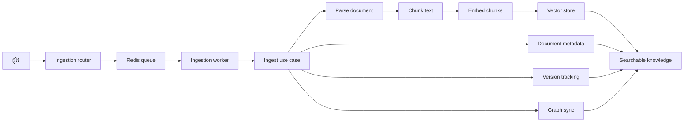

# Ingestion Walkthrough

หน้านี้อธิบายเส้นทางของเอกสารตั้งแต่ถูกส่งเข้าระบบ จนกลายเป็นข้อมูลที่ค้นหาได้ใน RAG stack

## ทำไมจึงสำคัญ

Ingestion คือขั้นตอนที่เปลี่ยนไฟล์ดิบ ข้อความดิบ หรือ URL ให้กลายเป็น knowledge ที่ index ได้ ถ้าเข้า flow นี้ จะเข้าใจทันทีว่า chunking, embeddings, graph extraction และ document versioning อยู่ตรงไหน

## Flow รวม

```text
ผู้ใช้ส่งเอกสาร
  -> Ingestion API ตรวจสอบ request
  -> ใส่ job ลง Redis queue
  -> worker ดึง job ไปทำงาน
  -> use case parse, chunk, embed และบันทึกข้อมูล
  -> บันทึก metadata และ version
  -> เอกสารถูกนำไปใช้ค้นหาได้
```



## ทีละขั้น

### 1. Request เข้าสู่ ingestion service

จุดเริ่มต้นปกติอยู่ที่ router ใน `ingestion/ingestion-service/interface/routers.py`

เส้นทางที่พบบ่อยคือ:

- อัปโหลดไฟล์
- ingest แบบข้อความดิบ
- preview ก่อน ingest จริง
- retry, cancel หรือ reprocess

Router ทำหน้าที่ validate input และแปลง request ให้เป็นรูปแบบที่ application layer ใช้ต่อได้

### 2. Job ถูกส่งเข้าคิว

ถ้าเป็น ingestion แบบ async router จะใส่ job ลง Redis-backed queue

ข้อดีคือ API ยังตอบได้เร็ว ในขณะที่งานหนักจะไปทำใน background และ queue ยังช่วยเก็บสถานะ การ retry และการ cancel ได้ด้วย

### 3. Worker ดึง job ไปทำงาน

`ingestion/ingestion-service/application/ingestion_worker.py` จะคอยดึง job จากคิว

worker จะ:

- ข้าม job ที่ถูก cancel
- เปลี่ยนสถานะเป็น processing
- อัปเดตความคืบหน้า
- retry เมื่อเจอ error ชั่วคราว
- ปิดงานเป็น done หรือ failed

ชั้นนี้คือส่วนที่ทำให้ job ในคิวกลายเป็นงาน ingestion จริง

### 4. Use case ประมวลผลเนื้อหา

logic หลักอยู่ใน `ingestion/ingestion-service/application/ingest_document_use_case.py`

flow โดยรวมคือ:

1. คำนวณ hash ของเนื้อหา
2. parse เอกสารเป็น text
3. ตรวจว่ามีเอกสารเดิมอยู่แล้วหรือไม่
4. บันทึก metadata ของเอกสาร
5. แบ่งข้อความเป็น chunk
6. สร้าง embeddings ของ chunk
7. upsert chunk ลง vector store
8. บันทึก document และ version
9. ลบเวอร์ชันเก่าถ้าจำเป็น

นี่คือจุดที่เนื้อหาดิบกลายเป็น knowledge ที่ค้นหาได้

### 5. งานฝั่ง graph ก็เข้ามาเกี่ยว

ระบบยังคงคิดถึงฝั่ง graph ด้วย

เมื่อ flow ถึงช่วง graph worker จะรายงาน progress ตามจังหวะนั้น และสามารถ sync entity กับ relationship ไปยัง graph service / Neo4j ได้

### 6. Preview เป็น flow ที่เบากว่า

preview endpoint ใช้ภาพรวมเดียวกันของเอกสาร แต่หยุดก่อนเข้าสู่ persistence แบบเต็ม

จึงใช้ตรวจสิ่งที่จะเกิดขึ้นก่อน commit งานเข้าระบบจริง

### 7. Status updates ช่วยให้ UI รู้ความคืบหน้า

ระหว่าง worker ทำงาน สถานะของ job จะค่อย ๆ เปลี่ยน เช่น queued, processing, done, failed หรือ cancelled

สถานะเหล่านี้คือสิ่งที่ทำให้ dashboard แสดงความคืบหน้าของ ingestion ได้

## ควรอ่านโค้ดต่อ

- `ingestion/ingestion-service/interface/routers.py`
- `ingestion/ingestion-service/application/ingestion_worker.py`
- `ingestion/ingestion-service/application/ingest_document_use_case.py`
- `ingestion/ingestion-service/application/preview_ingestion_use_case.py`
- `ingestion/ingestion-service/infrastructure/` adapters สำหรับ storage และ parser

## สิ่งที่ควรจำ

ถ้าเอกสารถูก ingest แล้วค้นหาไม่เจอ ปัญหามักอยู่ที่หนึ่งในขั้นตอนนี้:

- request validation
- queueing
- parsing
- chunking
- embedding
- vector upsert
- metadata persistence
- version bookkeeping
