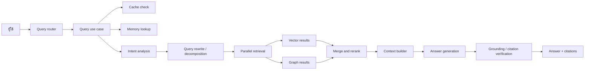

# Query Walkthrough

หน้านี้อธิบายเส้นทางของคำถามตั้งแต่ผู้ใช้ส่งเข้าระบบ จนระบบตอบกลับพร้อมหลักฐานประกอบ

## ทำไมจึงสำคัญ

ฝั่ง query คือส่วนที่ทำให้เห็น design ของ RAG ชัดที่สุด เพราะจะเห็น retrieval, reranking, memory, grounding และ citation checks อยู่ใน pipeline เดียว

## Flow รวม

```text
ผู้ใช้ถามคำถาม
  -> Query API รับ request
  -> use case ตรวจ cache, memory และ intent ของ query
  -> retrieval ทำงานกับ vector และ graph sources
  -> รวมผลและ rerank
  -> สร้างและบีบอัด context
  -> สร้างคำตอบและตรวจสอบ
  -> ส่ง citation และ metadata กลับไป
```



## ทีละขั้น

### 1. Request เข้าสู่ RAG service

จุดเริ่มต้นหลักอยู่ที่ `core/rag-service/interface/routers.py`

router รับ payload ของคำถามและส่งต่อให้ application layer เป็น boundary ระหว่าง HTTP กับ RAG pipeline

### 2. Use case เริ่ม orchestration

logic หลักอยู่ใน `core/rag-service/application/query_use_case.py`

ก่อนจะ retrieval ระบบอาจ:

- ตรวจ rate limit
- อ่าน semantic cache
- consult memory
- วิเคราะห์ intent ของคำถาม
- rewrite หรือ decompose query

ขั้นตอนนี้ช่วยตัดสินว่าพipeline ต่อจากนี้ควรหนักแค่ไหน

### 3. Retrieval ทำงานแบบขนาน

ระบบแตก query ไปค้นจากหลาย source

เส้นทางที่พบบ่อยคือ:

- vector retrieval จาก chunk store
- graph retrieval จาก graph service
- retrieval ตาม namespace หรือ source

จากนั้นระบบจะรวม candidate set เข้าด้วยกัน เช่นด้วย RRF

### 4. Candidate ถูกจัดอันดับอีกครั้ง

หลัง retrieval รอบแรก ระบบจะ rerank candidate อีกครั้ง

จุดนี้ช่วยให้ context สุดท้ายเน้น passage ที่ตอบคำถามได้จริง ไม่ใช่แค่ embedding similarity สูงอย่างเดียว

### 5. สร้าง context

จากนั้น use case จะเตรียม context สำหรับ generation

อาจมีการ:

- จัดกลุ่ม passage ที่เกี่ยวข้อง
- compress context ที่ยาวเกินไป
- ให้ความสำคัญกับข้อมูลใหม่กว่าถ้าจำเป็น
- เติม memory หรือ conversation context
- ส่งบางส่วนไปยัง tool ถ้าต้องใช้เครื่องมือช่วย

นี่คือจุดที่ผล retrieval ถูกแปลงเป็น evidence ที่ prompt ใช้งานได้

### 6. สร้างคำตอบ

เมื่อ prompt พร้อม ระบบจะสร้างคำตอบ

pipeline ใช้ได้ทั้งแบบ streaming และ non-streaming ขึ้นอยู่กับ caller ถ้าเป็น streaming จะช่วยให้ UI แสดงคำตอบบางส่วนได้เร็วขึ้น

### 7. ตรวจ citation และ grounding

ระบบไม่ได้หยุดแค่ generation

ยังตรวจว่าคำตอบยึดกับหลักฐานที่ค้นมาจริงหรือไม่ และส่ง citation หรือ reference กลับไปพร้อมผลลัพธ์สุดท้าย

### 8. บันทึก feedback ได้

ถ้า pipeline เจอช่องว่างหรือความไม่แน่ใจ ระบบสามารถบันทึก signal สำหรับวิเคราะห์ต่อได้

ข้อมูลนี้ช่วย intelligence layer เรียนรู้ว่าตรงไหนควรปรับ retrieval, coverage หรือ prompt

### 9. Streaming และ non-streaming ใช้ pipeline แกนเดียวกัน

ขั้นตอนสร้างคำตอบสุดท้ายอาจส่งออกทีละ token หรือส่งกลับมาทั้งชุด

ทั้งสองแบบใช้ retrieval และ context-building ชุดเดียวกัน ดังนั้นเวลาตรวจปัญหาควรเริ่มจากชั้นบนของ pipeline ก่อน ไม่ใช่ transport layer

## ควรอ่านโค้ดต่อ

- `core/rag-service/interface/routers.py`
- `core/rag-service/application/query_use_case.py`
- `core/rag-service/application/retrieval/`
- `core/rag-service/application/generation/`
- `core/rag-service/infrastructure/`
- `intelligence-service/main.py`

## สิ่งที่ควรจำ

ถ้าคำตอบยังอ่อนอยู่ ปัญหามักอยู่ที่หนึ่งในขั้นตอนนี้:

- query rewrite
- retrieval quality
- reranking
- context packing
- tool routing
- generation settings
- citation verification
